# 하이퍼레저 패브릭 기반의 프리랜서 플랫폼

---

## 1. **네트워크 구성도**

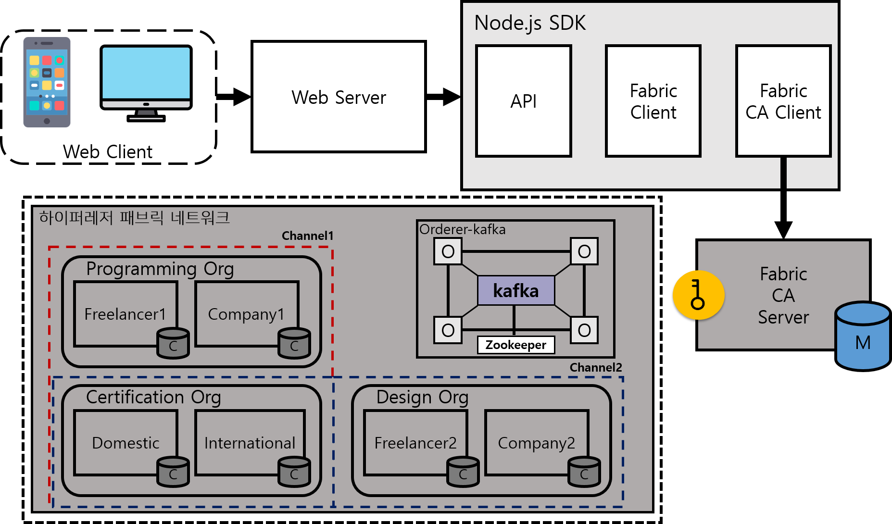

#### 1.1 참여개체

#### 프리랜서

- ##### 자격증명을 받고 싶은 정보를 인증기관에게 인증 받고 아이디와 패스워드를 발급 받은 후 하이퍼레저 패브릭 네트워크에 참여함
- ##### 플랫폼상에서 원하는 구인공고에 지원할 수 있으며 보상으로 토큰을 받음

#### 기업

- ##### 기업임을 인증기관에게 인증 받고 아이디와 패스워드를 발급 받은 후 하이퍼레저 패브릭 네트워크에 참여함
- ##### 플랫폼상에서 프리랜서를 구인할 때 원하는 조건을 입력하면 체인코드상에서 지원한 프리랜서의 조건이 충족하는지 검증하며 조건이 검증된 프리랜서들 중 고용하게 됨
- ##### 계약이 끝난 프리랜서에게 평점을 줄 수 있음

#### 인증기관(TTP)

- ##### 신뢰 된 제 3자(Trusted Third Party, TTP)로써 프리랜서가 인증요청한 자격증과 경력등을 발급기관에게 인증을 받고 블록체인 상에 기록하게 됨

<br>

#### 1.2 하이퍼레저 패브릭 채널

##### 모든 자격정보에 대한 인증은 Certification 조직에 의해 인증됨

##### channel 1(channelprog)

- ##### 채널1은 프로그래밍 기업와 프리랜서를 위한 채널
- ##### 프로그래밍과 관련된 기업와 프리랜서들이 체인코드를 통해 구인구직이 이루어짐

##### channel 2(channeldesign)

- ##### 채널2은 디자인 관련 기업와 프리랜서를 위한 채널
- ##### 디자인과 관련된 기업와 프리랜서들이 체인코드를 통해 구인구직이 이루어짐

##### 테스트를 위해 두개의 채널만 생성했지만 여러개의 채널을 통해 다양에 적용가능함

<br>

## 2. 체인코드

#### 2.1 체인코드 함수 목록

| 함수이름          | 기능                                                            | 실행권한         |
| :---------------- | :-------------------------------------------------------------- | :--------------- |
| setWallet         | 기업과 프리랜서들의 지갑 생성                                   | 인증기관         |
| GetWallet         | 기업과 프리랜서들의 지갑 조회                                   | 모든 참여개체    |
| SetCertificate    | 프리랜서의 자격증명 생성                                        | 인증기관         |
| GetCertificate    | 프리랜서의 자격증명 조회                                        | 모든 참여개체    |
| UpdateCertificate | 프리랜서의 자격증명 수정                                        | 인증기관         |
| SetJobPosting     | 구인공고 생성                                                   | 기업             |
| GetJobPosting     | 모든 구인공고 조회                                              | 모든 참여개체    |
| setApply          | 프리랜서가 구인공고 중 원하는 곳에 지원                         | 프리랜서         |
| VerifyConditions  | 구인공고에 게시된 요구조건을 만족하는지 검증                    | setApply         |
| ReturnCertificate | 해당되는 자격증명 문서를 반환                                   | VerifyConditions |
| setFreelancer     | 조건을 충족하는 프리랜서들 중 한명 또는 다수를 고용             | 기업             |
| SetRating         | 고용한 프리랜서에게 평점을 줌                                   | 기업             |
| UpdateRating      | 프리랜서에 대한 평점을 반영하여 업데이트 함                     | setRating        |
| DeleteJobPosting  | 고용이 만료되었을 시 GetJobPosting 실행시 조회되지 않게 삭제 함 | UpdateRating     |

##### 실행권한은 외부 라이브러리인 CID를 통해 접근제어 컨트롤을 할 수 있게 구현

```go
//setWallet에서 적용된 CID를 통한 접근제어
func (s *SmartContract) setWallet(APIstub shim.ChaincodeStubInterface, args []string) pb.Response {

   mspid, _ := cid.GetMSPID(APIstub)

   if mspid != "CertOrg" {
      return shim.Error("You do not have permission")
   }
}
```

#### 2.2 동작 흐름도

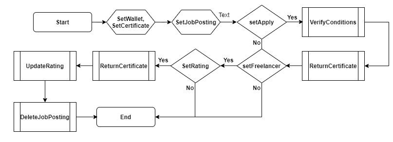

---

# 개발결과 테스트

##### 개발환경 및 테스트에 필요한 초기값을 설정하고 기업이 원하는 조건에 맞는 프리랜서를 고용하는 과정에 대한 설명

## 1. 개발 환경

|     구분     | 버전 또는 툴                           |
| :----------: | :------------------------------------- |
| **운영체제** | Ubuntu 18.04.5 LTS                     |
| **가상머신** | Virtual Box 6.0.24                     |
|  **에디터**  | VScode 최신버전                        |
|   **서버**   | Node.js 8.17.0, AngularJS              |
| **가상머신** | Virtual Box 6.0.24                     |
| **컨테이너** | Docker 20.10.5, Docker-Composer 1.26.0 |
| **블록체인** | Hyperledger Fabric 1.4                 |

## 2. **웹 상에서 구현한 함수 목록**

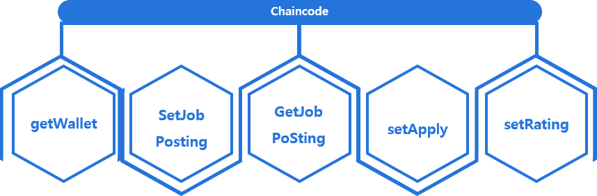

<br>

## 3. 테스트 전 초기값 설정

|  참여개체  |     이름     |    아이디    | 비밀번호 | 보유토큰 |
| :--------: | :----------: | :----------: | :------: | :------: |
| 프리랜서 1 |  HyunwooKim  | hyunwoo0216  |  hyper   |   100    |
| 프리랜서 2 | JinyoungJung | jinyoung0217 |  ledger  |   100    |
| 프리랜서 3 | GildongHong  |  gildong337  |  fabric  |   100    |

<br>

#### 3.1 getWallet 구현

##### 아이디 입력을 통해 `HyunwooKim` 유저와 `jinyoungJung` 유저의 초기 보유 토큰이 100임을 확인할 수 있음

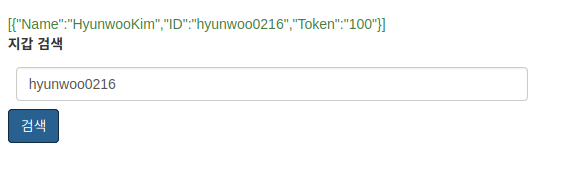
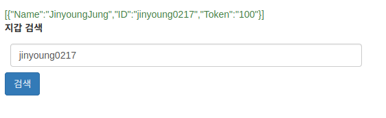

## 4. 구인공고 게시

##### 테스트를 위해 아래 테이블의 구인공고를 4.1의 방법으로 사전에 생성함

|      모집분야      |   아이디    | 비밀번호 | 요구조건                                               | 보수 | 계약기간   |
| :----------------: | :---------: | :------: | :----------------------------------------------------- | :--: | :--------- |
| Hyperledger 개발자 |     IBM     |  psword  | OPIC IH, 참여 횟수 10회 이상, 평점 3.5, 정보처리기사   |  20  | 2022-02-01 |
|   Golang 개발자    |   Samsung   |  psword  | OPIC IH, 참여 횟수 5회이상, 평점 4.3이상, 정보처리기사 |  10  | 2022-02-02 |
|  Network 엔지니어  | Cisco Korea |  psword  | CCNP, 토익 800이상, 정보처리기사                       |  15  | 2022-02-03 |

#### 4.1 SetJobPosting 구현

##### 기업이 원하는 조건의 프리랜서를 구인하기 위해 구인 공고 게시판에 아래 사진과 같이 입력하게 되면 블록체인에서 파라미터로 받아 체인코드 상에서 구인공고가 생성됨

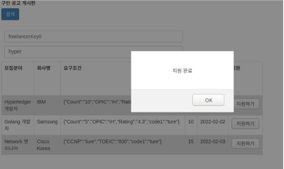

---

## 5. 구인공고 게시판 조회 및 지원하기

##### 구인공고 게시판을 통해 구인공고 목록을 확인 할 수 있으며 프리랜서는 자신이 원하는 곳에 지원할 수 있음

#### 5.1 GetJobPosting 구현

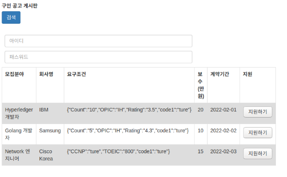

##### 프리랜서들의 자격정보

|      Key       |     이름     | 비밀번호 |                       자격정보                        |
| :------------: | :----------: | :------: | :---------------------------------------------------: |
| freelancerKey0 |  HyunwooKim  |  hyper   | 정보처리기사, CCNP, OPIC IH,**_평점 4.5_**, 10회 참여 |
| freelancerKey1 | JinyoungJung |  ledger  | 정보처리기사, CCNP, OPIC IH, **_평점 4.4_**, 5회 참여 |
| freelancerKey2 | GildongHong  |  fabric  |              CCNP, 정보보안기사, OPIC IM              |

<br>

#### 5.2 setApply 구현
##### 요구조건에 충족하지 못하거나 ID/PW를 통해 본인의 자격정보임을 인증하지 못할 시 에러를 반환한다

##### 5.2.1 요구조건에 충족하지 못하는 경우

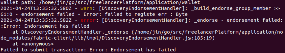

##### 위의 그림과 같이 요구조건을 충족하지 못하는 경우는 체인코드상에서 아래와 같은 에러를 반환한다

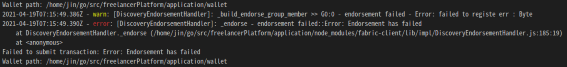

<br>

##### 5.2.2 요구조건에 충족한 경우

##### setFreelancer 함수 호출을 통해 요구조건을 충족하는 프리랜서 중 한명 또는 다수를 고용하게 된다 현재는 요구조건을 충족하는 프리랜서 중 가장 평점이 높은사람을 고용하게 설계하여 `IBM`이 게시한 구인공고는 `HyunwooKIM`유저를 고용하였다

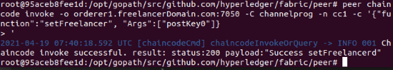

## 6. 평점설정 및 지불하기

#### 6.1 setRating 구현

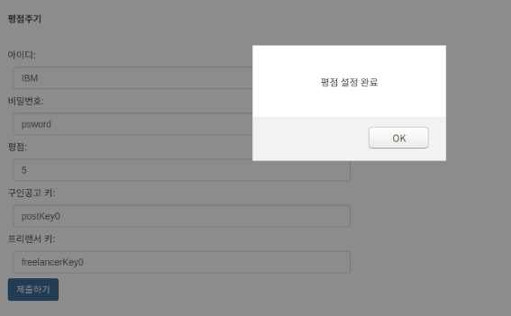

##### 해당 기업이 고용한 프리랜서임을 ID/PW를 통해 인증하게되면 아래와 같이 프리랜서에 대한 평점을 설정할 수 있으며 아래의 함수 들을 실행시킨다

##### 6.1.1 구인공고 삭제 및 보수 지불 (DeleteJobPosting)

##### 거래가 종료되어 `IBM`의 구인공고가 삭제되었음을 확인 할 수 있음

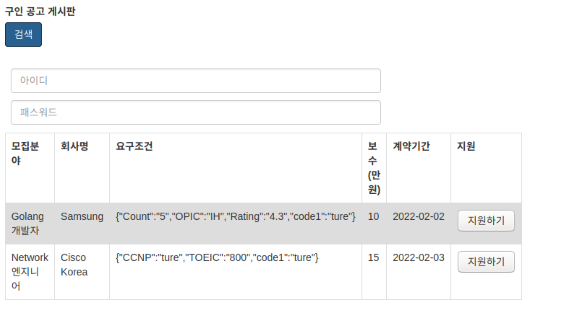

##### 프리랜서 `HyunwooKim`의 토큰 변화 100 => 120

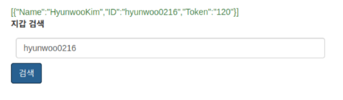

##### 기업 `IBM`의 토큰 변화 100 => 80

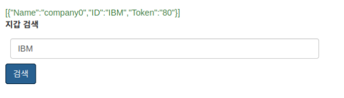

##### 6.2.2 평점 업데이트 (UpdateRating)

##### 평점이 업데이트 되었고 참여 횟수 또한 10에서 11로 증가한 것을 확인 할 수 있음

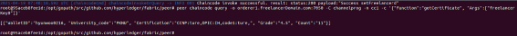

---

# 기대효과
